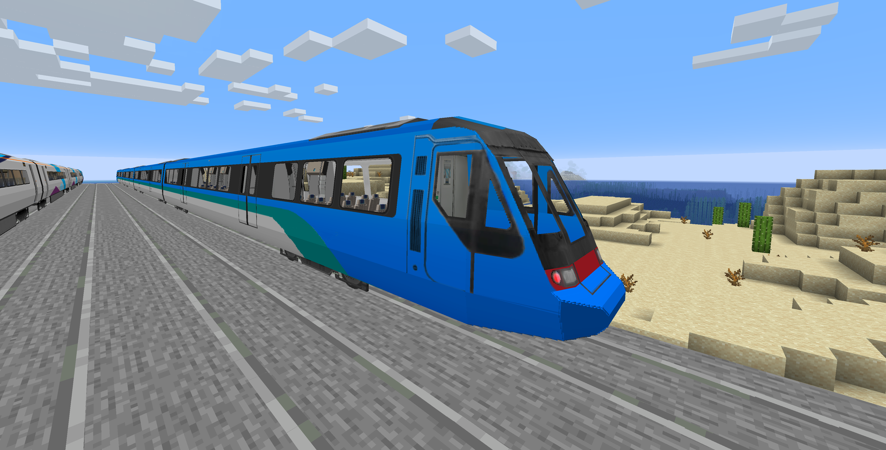
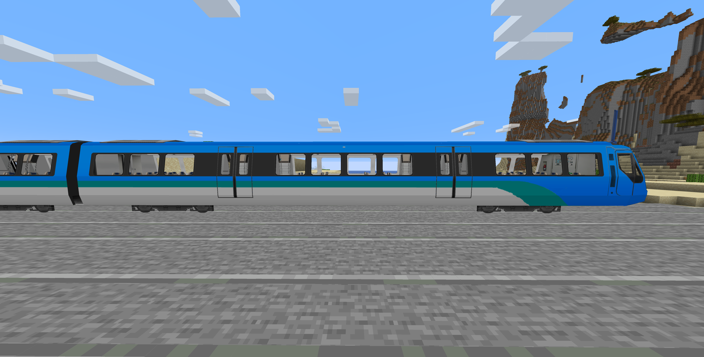

# 无飞机图标的A-Train-ARL列车

这是一个为Minecraft的 [Minecraft-Transit-Railway](https://github.com/Minecraft-Transit-Railway/Minecraft-Transit-Railway) MOD设计的资源包，为A-Train的ARL列车设计的减去飞机图标的涂装。

## 车型

- **红色腰线涂装：红色腰线**（`#008d8d`​） **、黑色车窗**
- **内饰： 无更改**
- **车型支持 - A-train-AEL标准规格：10窗2门**

## 外观

### 列车外观展示

**车头正面视图（无变化）**


**列车侧面视图**


**列车内饰视图（无变化）**


## 文件结构

```
resource_pack/
    ├── pack.mcmeta          # 元数据
    ├── pack.png            # 图标
    └── assets/
        └── mtr/
            ├── mtr_custom_resources.json  # 列车配置
            └── custom_directory/
                ├── a_train_ael_noicon.png  # 列车纹理
                └── custom_sign.png       # 标志纹理
```

## 如何安装

1. 下载本资源包
2. 将`resource_pack`​文件夹的内容以下内容打包为ZIP文件并复制到Minecraft的`resourcepacks`目录中：

   ```language
   resource_pack/
    ├── pack.mcmeta          # 元数据
    ├── pack.png            # 图标
    └── assets/
        └── mtr/
            ├── mtr_custom_resources.json  # 列车配置
            └── custom_directory/
                ├── a_train_ael_noicon.png  # 列车纹理
                └── custom_sign.png       # 标志纹理
   ```
3. 在游戏中启用此资源包
4. 确保已安装MTR模组

## 兼容性

- **Minecraft版本**：支持1.16版本
- **MTR模组版本**：支持3.2.2，但也支持在此之后的版本（比如4.0.2）

### 如何解决版本不兼容

进入资源包文件夹下的pack.mcmeta，你将看到如下内容

```mcmeta
{
	"pack": {
		"pack_format": 6,
		"description": "AEL train with No Icon"
	}
}
```

将`"pack_format"`​的值更改为你使用的版本号：内容来自[Minecraft官方wiki](https://zh.minecraft.wiki/w/%E8%B5%84%E6%BA%90%E5%8C%85#pack.mcmeta)

|版本|数字|
| ------------------| -------|
|1.6.1 - 1.8.9|1|
|1.9 - 1.10.2|2|
|1.11 - 1.12.2|3|
|1.13 - 1.14.4|4|
|1.15 - 1.16.1|5|
|1.16.2 - 1.16.5|6|
|1.17 - 1.17.1|7|
|1.18 - 1.18.2|8|
|1.19 - 1.19.2|9|
|1.19.3|11-12|
|1.19.4|13|
|1.20 - 1.20.1|15|
|1.20.2|16-18|
|1.20.3 - 1.20.4|22|
|1.20.5 - 1.20.6|32|
|1.21 - 1.21.4|47|
|1.21.5|55|
|1.21.6 - 1.21.8|64|
|1.21.9 - 1.21.10|69.0|
|1.21.11|75.0|

## 许可证

本项目采用MIT许可证。详见[LICENSE](LICENSE)文件。
